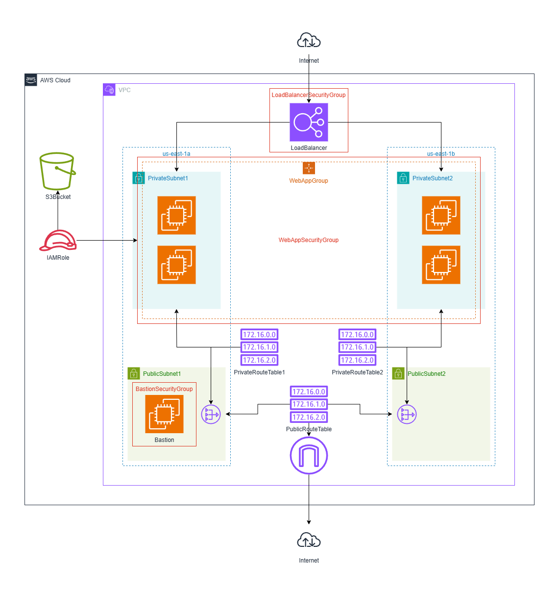

# CD12352 - Infrastructure as Code Project Solution
Jasin Zujovic

## Management script
Usage:
```
./stack.sh {network|udagram} {create|update|delete}
```
One of **network** or **udagram** must be selected.

One of **create**, **update**, or **delete** must be selected.

## Spin up instructions
```
./stack.sh network create  
./stack.sh udagram create
```

## Tear down instructions
```
./stack.sh udagram delete
./stack.sh network delete
```

## Update instructions
```
./stack.sh network update
```
```
./stack.sh udagram update
```

## Public URL
```
./getURL.sh
```
With the **udagram** stack running, output the public URL and update it in this document.

Click to test: http://udagra-LoadB-7Darm5NlstiT-2123761080.us-east-1.elb.amazonaws.com

## Infrastructure diagram

